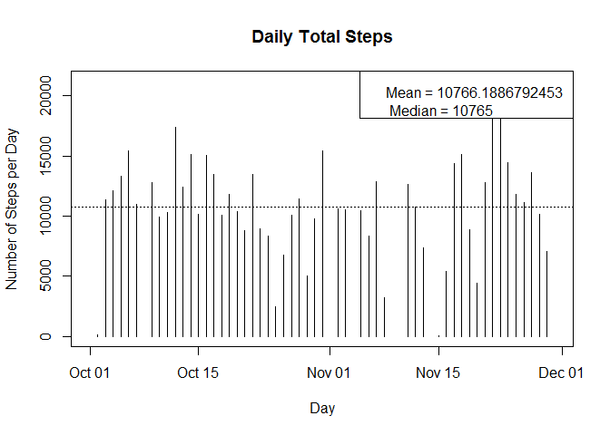
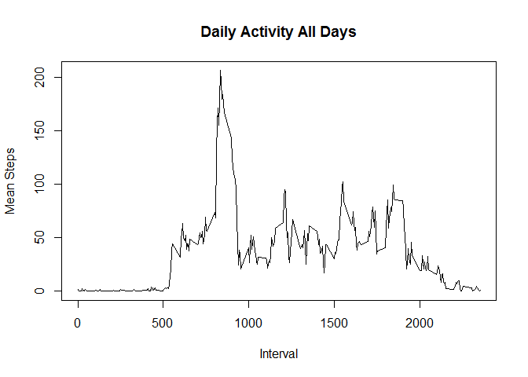
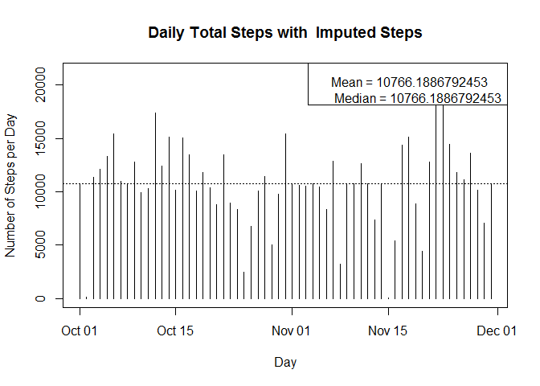
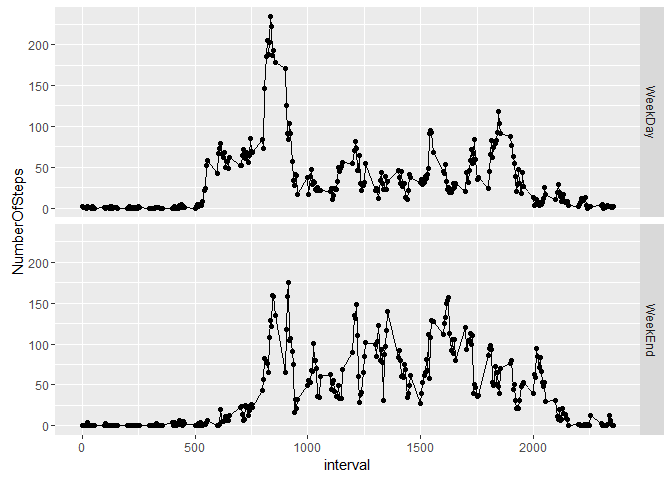
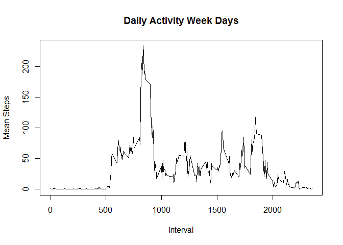
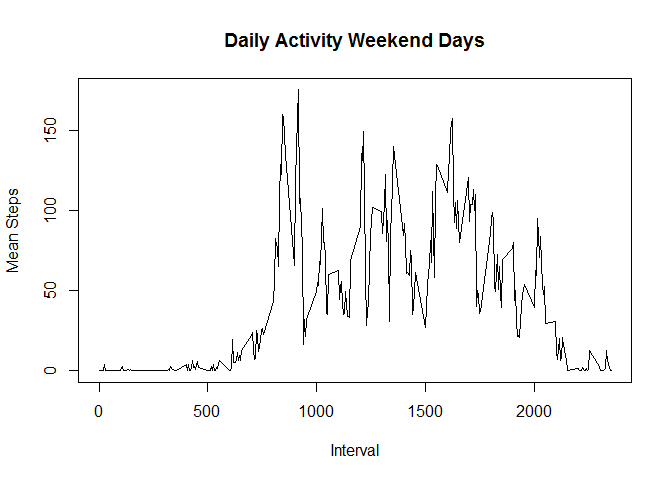

    This is part of Data Scinece / Reproducible Research week1 project work. It uses activity monitoring data available at https://d396qusza40orc.cloudfront.net/repdata%2Fdata%2Factivity.zip  .  This data is also supplied as part of Github Repo for this project. In this project, I  attempt to address the following questions :

Commit containing full submission
<list>
Code for reading in the dataset and/or processing the data
<li>Histogram of the total number of steps taken each day</li>
<li>Mean and median number of steps taken each day</li>
<li>Time series plot of the average number of steps taken</li>
<li>The 5-minute interval that, on average, contains the maximum number of steps</li>
<li>Code to describe and show a strategy for imputing missing data</li>
<li>Histogram of the total number of steps taken each day after missing values are imputed</li>
<li>Panel plot comparing the average number of steps taken per 5-minute interval across weekdays and weekends</li>
<li>All of the R code needed to reproduce the results (numbers, plots, etc.) in the report</li>
</list>

<hr>
Generated images are stored in folder  PA1_template_files\figure-html 

<hr>
## 1. Code for reading in the dataset and/or processing the data


```r
library(timeDate)
library(plyr)
library(ggplot2)
#setwd("~/GitHub/RepData_PeerAssessment1")
df<- read.csv("activity.csv")
print("Raw data as read in ")
```

```
## [1] "Raw data as read in "
```

```r
print(head(df))
```

```
##   steps       date interval
## 1    NA 2012-10-01        0
## 2    NA 2012-10-01        5
## 3    NA 2012-10-01       10
## 4    NA 2012-10-01       15
## 5    NA 2012-10-01       20
## 6    NA 2012-10-01       25
```

```r
#Compute Date class
df$date_dc <- as.Date(as.character(df$date), format="%Y-%m-%d")

#Compute Hours & Minutes from interval
df$hh <- as.integer((df$interval/100))
df$mm <- as.integer((df$interval%%100))

#Compute the POSIXct class time stamp
df$time_posix_ct <- as.POSIXct(as.character(df$date), format="%Y-%m-%d") + 3600 * df$hh + 60 * df$mm

#Compute timeDate class to determine weekday/weekend
df$tDate <-timeDate(df$date, format = "%Y-%m-%d")
df$weekday <- isWeekday(df$tDate, wday = 1:5)
df$weekend <- isWeekend(df$tDate, wday = 1:5)

#Sample data records after the above steps
print("Sample data frame after Preprocess / Transform ")
```

```
## [1] "Sample data frame after Preprocess / Transform "
```

```r
print(head(df))
```

```
##   steps       date interval    date_dc hh mm       time_posix_ct
## 1    NA 2012-10-01        0 2012-10-01  0  0 2012-10-01 00:00:00
## 2    NA 2012-10-01        5 2012-10-01  0  5 2012-10-01 00:05:00
## 3    NA 2012-10-01       10 2012-10-01  0 10 2012-10-01 00:10:00
## 4    NA 2012-10-01       15 2012-10-01  0 15 2012-10-01 00:15:00
## 5    NA 2012-10-01       20 2012-10-01  0 20 2012-10-01 00:20:00
## 6    NA 2012-10-01       25 2012-10-01  0 25 2012-10-01 00:25:00
##        tDate weekday weekend
## 1 2012-10-01    TRUE   FALSE
## 2 2012-10-01    TRUE   FALSE
## 3 2012-10-01    TRUE   FALSE
## 4 2012-10-01    TRUE   FALSE
## 5 2012-10-01    TRUE   FALSE
## 6 2012-10-01    TRUE   FALSE
```


## 2. Histogram of the total number of steps taken each day

```r
total_steps_per_day <- tapply(df$steps, df$date_dc, sum)
x_axis <- as.Date(rownames(total_steps_per_day))
y_axis <- as.numeric(total_steps_per_day)

#Daily Mean & Median
daily_mean <- mean(y_axis, na.rm=TRUE)
daily_median <- median(y_axis, na.rm=TRUE)
#Start of plots

#png(filename = "hist_daily_total_steps.png",    width = 960, height = 480, units = "px", pointsize = 12,    bg = "white", res = NA, family = "", restoreConsole = TRUE,    type = c("windows", "cairo", "cairo-png"))
plot(x_axis, y_axis, type="h", ylab="Number of Steps per Day", xlab="Day", main="Daily Total Steps")
legend("topright", legend=paste("Mean =", daily_mean , "\n", "Median =" , daily_median) ) 
#Horizontal base line drawn at mean
abline( h=daily_mean, lty=3)
```



```r
#dev.off()
```

## 3.Mean and median number of steps taken each day

```r
print(paste("Daily Mean=", daily_mean))
```

```
## [1] "Daily Mean= 10766.1886792453"
```

```r
print(paste("Daily Median=", daily_median))
```

```
## [1] "Daily Median= 10765"
```


## 4. Time series plot of the average number of steps taken

```r
#Daily activity plots / time series plots
# create df_weekday, df_weekend by subsetting df on weekday, weekend flags/factors
df_weekday <- subset(df, df$weekday == TRUE)
df_weekend <- subset(df, df$weekend == TRUE)

mean_steps_per_interval <- tapply(df$steps, df$interval, mean, na.rm=TRUE)
y_int_mean <- as.numeric(mean_steps_per_interval)
x_int_mean <- as.numeric(rownames(mean_steps_per_interval))
#png(filename = "avg_daily_activity.png",    width = 960, height = 480, units = "px", pointsize = 12,    bg = "white", res = NA, family = "", restoreConsole = TRUE,    type = c("windows", "cairo", "cairo-png"))
plot(x_int_mean, y_int_mean, type="l", xlab="Interval", ylab="Mean Steps", main="Daily Activity All Days")
```



```r
#dev.off()
```

## 5. The 5-minute interval that, on average, contains the maximum number of steps

```r
df_max_mean_int <- data.frame(y_int_mean, x_int_mean)
df_max_mean_int <- arrange(df_max_mean_int, desc(df_max_mean_int$y_int_mean))
mean_max_steps <- df_max_mean_int$y_int_mean[1]
mean_max_interval <- df_max_mean_int$x_int_mean[1]
print(paste("Max of mean steps per interval / Mean Steps :", mean_max_steps))
```

```
## [1] "Max of mean steps per interval / Mean Steps : 206.169811320755"
```

```r
print(paste("Max of mean steps per interval / Mean Interval :", mean_max_interval))
```

```
## [1] "Max of mean steps per interval / Mean Interval : 835"
```


## 6. Code to describe and show a strategy for imputing missing data

```r
#Imputing Logic
#Make a copy of data frame df
df_copy <- df
#We will impute the missing  steps   from avg daily activity plot .
#Where we computed  "mean" for every interval over all the days.  intervals are 00:00 to 23:55
# this corresponds to indices 1..288 => each hour will have 12 and there are 24 hours in a day.
#We use the pre computed "hh" and "mm" to get mean for that particulare interval.

for(i in 1:nrow(df_copy)) {
  if(is.na(df_copy$steps[i] )) {
    df_copy$steps[i] <- y_int_mean[  df_copy$hh[i] * 12 +  df_copy$mm[i] / 5 + 1  ]
  }
}
```

## 7. Histogram of the total number of steps taken each day after missing values are imputed


```r
#Let us plot again with the now imputed data frame
total_steps_per_day_imp <- tapply(df_copy$steps, df_copy$date_dc, sum)
x_axis_imp <- as.Date(rownames(total_steps_per_day_imp))
y_axis_imp <- as.numeric(total_steps_per_day_imp)

#Daily Mean & Median
daily_mean_imp <- mean(y_axis_imp, na.rm=TRUE)
daily_median_imp <- median(y_axis_imp, na.rm=TRUE)
print(paste("Daily Mean after imputing =", daily_mean_imp))
```

```
## [1] "Daily Mean after imputing = 10766.1886792453"
```

```r
print(paste("Daily Median after imputing =", daily_median_imp))
```

```
## [1] "Daily Median after imputing = 10766.1886792453"
```

```r
#png(filename = "hist_daily_total_steps_imputed.png",    width = 960, height = 480, units = "px", pointsize = 12,    bg = "white", res = NA, family = "", restoreConsole = TRUE,    type = c("windows", "cairo", "cairo-png"))
plot(x_axis_imp, y_axis_imp, type="h", ylab="Number of Steps per Day", xlab="Day", main="Daily Total Steps with  Imputed Steps")
legend("topright", legend=paste("Mean =", daily_mean_imp , "\n", "Median =" , daily_median_imp) ) 
#Horizontal base line drawn at mean
abline( h=daily_mean_imp, lty=3)
```



```r
#dev.off()
```

## 8. Panel plot comparing the average number of steps taken per 5-minute interval across weekdays and weekends

```r
# create df_weekday, df_weekend by subsetting df on weekday, weekend flags/factors
df_weekday <- subset(df, df$weekday == TRUE)
df_weekend <- subset(df, df$weekend == TRUE)

mean_steps_per_interval_wd <- tapply(df_weekday$steps, df_weekday$interval, mean, na.rm=TRUE)
y_int_mean_wd <- as.numeric(mean_steps_per_interval_wd)
x_int_mean_wd <- as.numeric(rownames(mean_steps_per_interval_wd))

mean_steps_per_interval_we <- tapply(df_weekend$steps, df_weekend$interval, mean, na.rm=TRUE)
y_int_mean_we <- as.numeric(mean_steps_per_interval_we)
x_int_mean_we <- as.numeric(rownames(mean_steps_per_interval_we))
df_wd <- data.frame(interval=x_int_mean_wd, NumberOfSteps=y_int_mean_wd)
df_wd$day <- rep("WeekDay", 288)
df_we <- data.frame(interval=x_int_mean_we, NumberOfSteps=y_int_mean_we)
df_we$day <- rep("WeekEnd", 288)
df_wd_we <- rbind(df_wd, df_we)
qplot(interval, NumberOfSteps, data=df_wd_we, facets=day~.)+geom_line()
```




## 8.a Panel plot comparing the average number of steps taken per 5-minute interval across weekdays and weekends (Extra Credit / Base Plots??)


### Average Daily Activity on Week Days

```r
#png(filename = "avg_weekday_activity.png",    width = 960, height = 480, units = "px", pointsize = 12,    bg = "white", res = NA, family = "", restoreConsole = TRUE,    type = c("windows", "cairo", "cairo-png"))
plot(x_int_mean_wd, y_int_mean_wd, type="l", xlab="Interval", ylab="Mean Steps", main="Daily Activity Week Days")
```



```r
#dev.off()

#png(filename = "avg_weekend_activity.png",    width = 960, height = 480, units = "px", pointsize = 12,    bg = "white", res = NA, family = "", restoreConsole = TRUE,    type = c("windows", "cairo", "cairo-png"))
plot(x_int_mean_we, y_int_mean_we, type="l", xlab="Interval", ylab="Mean Steps", main="Daily Activity Weekend Days")
```



```r
#dev.off()
```


